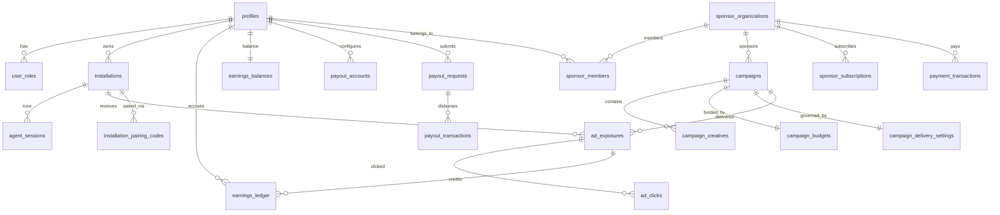

# AgentSponsor Database Architecture & Supabase Guide

This document specifies the complete production database architecture for AgentSponsor, covering the schema, security models, relationships, triggers, functions, and Supabase execution instructions.

---

## 1. Quick Setup via `queries.txt`

The repository root contains a single, self-contained, dependency-ordered SQL file:
[`queries.txt`](file:///home/inder/agysponsor/queries.txt)

### To apply to Supabase:
1. Open your [Supabase Dashboard](https://supabase.com/dashboard).
2. Select your project and navigate to the **SQL Editor** tab.
3. Open [`queries.txt`](file:///home/inder/agysponsor/queries.txt), copy its entire content, and paste it into the SQL Editor.
4. Click **Run**.
5. All extensions, enums, tables, indexes, triggers, functions, RLS policies, views, and initial seed data are applied cleanly.

---

## 2. Architecture Overview & ERD

---

## 3. Core Tables

### User Management & RBAC
- **`profiles`**: Synchronized with Supabase `auth.users`. Holds user email, full name, and avatar.
- **`user_roles`**: Role-based access control table mapping `user_id` to role (`CONSUMER`, `SPONSOR`, `ADMIN`). Protected by strict RLS: users cannot self-assign or escalate roles.

### CLI Client & Pairing
- **`installations`**: Tracks developer machine instances running the AgentSponsor plugin (`installation_uuid`, `device_name`, `os`, `client_version`, `status`, `paired_at`).
- **`installation_pairing_codes`**: Short-lived (15-minute) 8-character single-use codes (e.g. `8F4K-92JD`) displayed in terminal after `install.sh` / `install.ps1`. Linked to user accounts on `/connect`.

### Sponsorship & Campaigns
- **`sponsor_organizations`**: Corporate accounts running advertising campaigns.
- **`sponsor_members`**: Organization memberships with roles (`OWNER`, `ADMIN`, `MEMBER`).
- **`sponsor_plans`**: Subscription tiers (Starter, Growth, Scale) with monthly prices in INR, included credit budgets, and campaign limits.
- **`sponsor_subscriptions`**: Active sponsor recurring subscriptions.
- **`campaigns`**: Sponsorship initiatives with statuses (`DRAFT`, `PENDING_REVIEW`, `APPROVED`, `ACTIVE`, `PAUSED`, `COMPLETED`, `REJECTED`, `ARCHIVED`).
- **`campaign_creatives`**: One-line status bar ad copy (`advertiser_name`, `headline`, `description`, `destination_url`, `version`).
- **`campaign_budgets`**: Server-authoritative balances (`total_budget`, `remaining_budget`, `daily_budget`, `spent_today`).
- **`campaign_delivery_settings`**: Frequency capping and priority weights.

### Ad Delivery & Exposure Verification
- **`agent_sessions`**: Active Antigravity agent sessions.
- **`ad_exposures`**: Qualified impression tracking requiring server-issued HMAC tokens, minimum dwell duration, deduplication, and budget deduction.
- **`ad_clicks`**: Safe click-through tracking.

### Immutable Financial Ledger & Payouts
- **`earnings_ledger`**: Append-only transaction ledger with entry types (`EXPOSURE_REWARD`, `BONUS`, `ADJUSTMENT`, `PAYOUT_RESERVATION`, `PAYOUT_COMPLETED`, `REVERSAL`). No row in this table is mutated or deleted in production.
- **`earnings_balances`**: Atomic summary table maintaining `total_earned`, `pending_balance`, `available_balance`, and `paid_balance`, updated automatically via database trigger.
- **`payout_accounts`**: India-compatible withdrawal configurations (UPI ID or bank account details).
- **`payout_requests`**: Consumer withdrawal requests (`PENDING_REVIEW`, `APPROVED`, `COMPLETED`, `REJECTED`).
- **`payout_transactions`**: Disbursed payouts through provider integration.

### Payments, Fraud, & Audit
- **`payment_webhook_events`**: Idempotent webhook tracking with HMAC signature verification.
- **`fraud_signals`** & **`fraud_reviews`**: Automated suspicious activity monitoring.
- **`admin_actions`** & **`audit_logs`**: Tamper-evident admin activity logging.
- **`platform_settings`**: Global platform configuration (`consumer_reward_rate`, `platform_share_rate`, `min_payout_amount_inr`, etc.).

---

## 4. Row Level Security (RLS) Policies

All tables have RLS explicitly enabled:
- **Consumers** (`CONSUMER` role) can only view their own installations, ledger entries, earnings balances, payout accounts, and payout requests.
- **Sponsors** (`SPONSOR` role) can only access campaigns, creatives, and budgets belonging to their organizations.
- **Admins** (`ADMIN` role checked via `public.is_admin(auth.uid())`) have elevated access across all tables for review, moderation, and auditing.
- **Public**: Anonymous access is strictly limited to viewing active sponsor subscription plans (`sponsor_plans`) and public platform settings.

---

## 5. Triggers & Stored Procedures

1. **`handle_new_user()`**: Trigger on `auth.users` insertion. Creates the profile, assigns the default `CONSUMER` role, and initializes the `earnings_balances` row.
2. **`sync_earnings_balances()`**: Trigger on `earnings_ledger` write operations. Recalculates available, pending, paid, and total balances atomically.
3. **`claim_pairing_code(p_code, p_device_name)`**: Secure RPC function that verifies pairing code validity and links the installation to the authenticated user.
4. **`deduct_campaign_budget(p_campaign_id, p_cost)`**: Atomic stored procedure ensuring remaining budget is never overdrawn under high concurrency.
